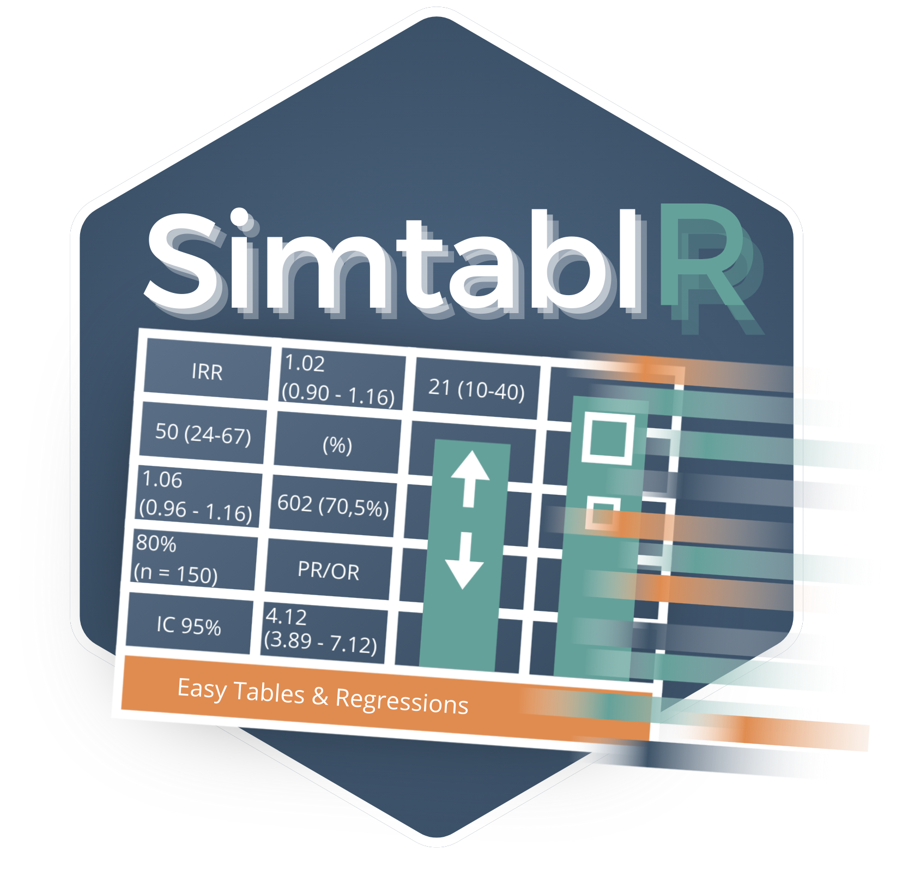

SimtablR: Fast, Design-Aware Epidemiological Analysis in R
================

<!-- README.md is generated from README.Rmd. Please edit that file -->



<!-- badges: start -->

[](https://github.com/MatheusTG-14/SimtablR/actions/workflows/R-CMD-check.yaml)
[](https://github.com/MatheusTG-14/SimtablR/actions/workflows/coverage.yaml)
<!-- badges: end -->

## Publication-Ready Epidemiology, Fast and Reproducible

**SimtablR** turns epidemiological data into publication-ready tables
and reports without separating the numbers from the decisions that
produced them.

In epidemiological and clinical research, analysts often transition from
GUI-based software or command-line packages such as Stata, SAS, SPSS, or
Epi Info. In R, producing standard baseline tables, 2x2 contingency
tables with risk ratios, multivariable regressions, or diagnostic
evaluations often requires combining multiple fragmented packages,
manually recoding dummy factors, calculating confidence intervals by
hand, and re-pasting tables into Word processors.

SimtablR eliminates this friction. It provides concise, direct functions
with sensible epidemiological defaults, while maintaining an explicit
specification layer for formal peer review and reproduction.

------------------------------------------------------------------------

### Key Architectural Commitments

- **Study-Design Aware:** Resolves epidemiologically valid effect
  measures (Risk Ratio, Odds Ratio, Prevalence Ratio, Incidence-Rate
  Ratio, Hazard Ratio) based on study design (`design = "cohort"`,
  `"case_control"`, or `"cross_sectional"`).
- **Separation of Evidence from Presentation:** Statistical engines
  calculate raw, unrounded values into `$data`. Display formatting,
  rounding, journal conventions (NEJM, Lancet, JAMA), and table
  rendering (`gt`, `flextable`, Word, Excel) occur only at the
  presentation boundary.
- **Welcoming to Learners & Fast for Experts:** Direct functions accept
  unquoted variable names, character strings, or tidyselect expressions.
  No boilerplate or data reshaping is required.
- **Non-Blocking Methodological Guidance:** The built-in advice engine
  (`advise()`) checks for sparse cells, unmeasured confounding, and
  assumption violations, guiding analysts without interrupting
  computational workflows.
- **Verb Closure:** Grammar verbs (`stratify()`, `adjust()`, `test()`,
  `missingness()`, `set_summary()`, `style()`) can be piped directly
  into computed results, automatically re-evaluating the specification.

------------------------------------------------------------------------

## Installation

Install the released version from CRAN:

``` r
install.packages("SimtablR")
```

Or install the development version from GitHub:

``` r
# install.packages("remotes")
remotes::install_github("MatheusTG-14/SimtablR")
```

``` r
library(SimtablR)
data(epitabl)
```

------------------------------------------------------------------------

## Core Functions & Key Parameters

### 1. Multi-Variable Baseline Cohort Tables: `table1()`

`table1()` constructs descriptive demographic and clinical baseline
tables grouped by an exposure, treatment, or clinical outcome.

``` r
table1(data, vars, by = NULL, summary = "auto", test = FALSE, labels = NULL, ...)
```

#### Key Parameters:

- `summary`: Continuous variable summary policy.
  - `"auto"` *(default)*: Computes skewness to automatically choose
    `Mean (SD)` for symmetric variables or `Median (IQR)` for skewed
    distributions.
  - `"mean"`: Forces Mean (SD) across all continuous metrics.
  - `"median"`: Forces Median (IQR) across all continuous metrics.
- `by`: Grouping variable (bare name or string). Produces stratified
  columns alongside sample denominators.
- `test`: Logical or test specification. When `test = TRUE`, performs
  hypothesis tests (t-test, Wilcoxon, ANOVA, Kruskal-Wallis, N-1
  $\chi^2$, or Fisher’s exact test).
- `labels`: Named character vector mapping raw variable names to
  human-readable labels and measurement units.
- `missingness`: By default, reports explicit counts and percentages of
  missing observations (`N Missing (%)`) to maintain clinical
  denominator transparency.
- `test(smd = TRUE)`: Via verb closure, Standardized Mean Differences
  (SMDs) can be appended to any baseline table for observational
  propensity or balance assessments.

``` r
# Example: Multi-variable description with automated summaries, testing, and SMDs
tab_baseline <- table1(
  epitabl,
  c(age, sex, bmi, smoking, hypertension, diabetes, renal_impairment, presentation_hours),
  by = adjudicated_acs,
  test = TRUE,
  labels = c(
    age = "Age (years)",
    bmi = "Body Mass Index (kg/m²)",
    presentation_hours = "Time to ED Presentation (hours)"
  )
) |>
  test(smd = TRUE)

tab_baseline
```

------------------------------------------------------------------------

### 2. Focused Contingency & 2x2 Tables: `tb()`

`tb()` produces focused bivariate frequency tables, cross-tabulations,
hypothesis tests, and epidemiological association measures.

``` r
tb(data, row_var, col_var, flags = ..., design = ..., strat = ..., ref = ...)
```

#### Key Parameters & Terse Flags:

- `flags`: Concise string flags defining cell contents and effect
  measures:
  - Percentage denominators: `"row"` (row %), `"col"` (column %),
    `"cell"` (total table %).
  - Effect measures: `"rr"` (Relative Risk / Risk Ratio), `"or"` (Odds
    Ratio), `"pr"` (Prevalence Ratio).
  - Inference: `"p"` (adds p-value), `"miss"` (displays missing
    categories).
- `design`: Epidemiological study design (`"cohort"`, `"case_control"`,
  `"cross_sectional"`). When specified without explicit measure flags,
  SimtablR automatically resolves the correct effect measure (e.g., RR
  for cohorts, OR for case-control).
- `strat`: Stratifying variable. Calculates stratum-specific effects,
  tests for homogeneity of odds/risk ratios across strata, and computes
  Greenland-Robins Mantel-Haenszel pooled estimates.
- `ref`: Overrides the reference level for exposure or outcome
  categories without requiring `relevel()` data transformations.

``` r
# Example 2.1: Exposure-stratified cohort 2x2 table with Risk Ratio
tb(epitabl, renal_impairment, adjudicated_acs, flags = c("row", "rr"), design = "cohort")

# Example 2.2: Stratified analysis with Mantel-Haenszel pooling across sex
tb(epitabl, renal_impairment, adjudicated_acs, strat = sex, flags = c("row", "or"))
```

Multiple bivariate tables can also be stacked into a single consolidated
summary using standard `rbind()`:

``` r
tab1 <- tb(epitabl, smoking, adjudicated_acs, flags = c("row", "or"))
tab2 <- tb(epitabl, diabetes, adjudicated_acs, flags = c("row", "or"))
rbind(tab1, tab2)
```

------------------------------------------------------------------------

### 3. Multivariable Regression & Rare-Event Modeling: `regtab()`

`regtab()` fits generalized linear models (GLMs) across one or multiple
outcomes over a shared predictor specification, reporting adjusted
effect measures with confidence intervals.

``` r
regtab(data, outcomes, predictors, family = binomial("logit"), robust = TRUE, method = "glm", ...)
```

#### Key Parameters:

- `outcomes`: Character vector of outcome variables. Specifying multiple
  outcomes fits separate models simultaneously and binds them into a
  consolidated publication table.
- `predictors`: Two-sided formula (e.g.,
  `~ age + sex + smoking + renal_impairment`).
- `family`: Standard GLM error distribution and link function
  (`binomial("logit")`, `gaussian()`, `poisson()`, `quasipoisson()`).
- `robust`: Robust sandwich covariance estimation. Defaults to `TRUE`
  (HC0 heteroscedasticity-consistent variance). Supports `"HC3"` for
  small samples, or `FALSE` for classical model-based variance.
- `method`: Estimation method.
  - `"glm"` *(default)*: Standard maximum likelihood.
  - `"firth"`: Firth’s penalized likelihood regression (via `logistf`),
    eliminating small-sample bias and handling complete separation in
    rare clinical exposures.

``` r
# Example 3.1: Multivariable logistic regression with HC0 robust standard errors
fit_glm <- regtab(
  epitabl,
  outcomes = "adjudicated_acs",
  predictors = ~ age + sex + smoking + hypertension + diabetes + renal_impairment,
  family = binomial("logit"),
  robust = TRUE
)
fit_glm

# Example 3.2: Firth penalized likelihood for rare exposure (maintenance dialysis)
fit_firth <- regtab(
  epitabl,
  outcomes = "adjudicated_acs",
  predictors = ~ age + sex + dialysis,
  family = binomial("logit"),
  method = "firth"
)
fit_firth
```

------------------------------------------------------------------------

### 4. Time-to-Event Survival Analysis: `survtab()`

`survtab()` fits Cox proportional hazards models for right-censored
time-to-event outcomes, reporting hazard ratios (HR), confidence
intervals, and model diagnostics.

``` r
survtab(data, time, event, predictors, robust = FALSE, ...)
```

#### Key Parameters:

- `time`: Follow-up observation time (e.g., days to event or censoring).
- `event`: Binary event indicator (`"Yes"`/`"No"`, `1`/`0`, or
  `TRUE`/`FALSE`).
- `predictors`: Formula defining covariates.
- Diagnostics: Automatically computes Schoenfeld residual tests
  (`cox.zph`) to verify the proportional hazards assumption.
- Graphical output: Forest plots of estimated hazard ratios are
  generated directly using `autoplot()`.

``` r
# Example: 1-Year MACE time-to-event model
fit_cox <- survtab(
  epitabl,
  time = mace_time_days,
  event = mace_event,
  predictors = ~ age + sex + smoking + renal_impairment
)
fit_cox
```

------------------------------------------------------------------------

### 5. Clinical Diagnostic Accuracy & ROC Discrimination: `diag_test()` & `roc()`

SimtablR provides dedicated tools for diagnostic evaluations aligned
with STARD reporting guidelines.

#### Binary Diagnostic Tests: `diag_test()`

Evaluates an index test against a reference standard, generating 2x2
contingency counts, Sensitivity, Specificity, Positive Predictive Value
(PPV), Negative Predictive Value (NPV), Positive/Negative Likelihood
Ratios (LR+, LR-), and Diagnostic Odds Ratios (DOR).

``` r
substudy <- subset(epitabl, diagnostic_substudy == "Yes")

acc <- diag_test(
  substudy,
  test = poc_hstn_positive,
  ref = adjudicated_acs,
  positive = "Yes",
  test_positive = "Positive",
  ci = "exact"
)
acc

# Visual fourfold plot
plot(acc)
```

#### Continuous Biomarker Discrimination: `roc()`

Calculates empirical Area Under the ROC Curve (AUC) with DeLong 95%
confidence intervals, optimal decision thresholds via Youden’s J
statistic (`cutpoint = "youden"`), and publication-ready ROC curves.

``` r
roc_curve <- roc(
  substudy,
  marker = poc_hstn_value,
  outcome = adjudicated_acs,
  positive = "Yes",
  cutpoint = "youden"
)
roc_curve
```

------------------------------------------------------------------------

### 6. The Declarative Grammar & Composite Reports: `simtab()` & `simtablr()`

For structured research pipelines, the grammar decouples planning from
computation:

``` r
# 1. Build an inert specification (the plan)
plan <- simtab(epitabl) |>
  describe(c(age, sex, bmi, renal_impairment)) |>
  stratify(adjudicated_acs) |>
  set_summary("auto") |>
  missingness(display = TRUE) |>
  overall(TRUE) |>
  test("auto")

# 2. Evaluate when ready
res <- evaluate(plan)
```

#### Composite Manuscript Reports with `simtablr()`

Automatically couples a descriptive Table 1 and an inferential Table 2
into a single report object:

``` r
report <- simtablr(
  epitabl,
  outcome = adjudicated_acs,
  exposure = renal_impairment,
  vars = c(age, sex, smoking, hypertension, diabetes),
  adjust = c(age, sex, smoking),
  design = "cohort"
)

# Access individual tables
report$table1
report$table2
```

------------------------------------------------------------------------

### 7. Methodological Audit, Reviewer Analyses & Export

#### Non-Blocking Methodological Audit: `advise()`

Evaluates result evidence against epidemiological rules (sparsity,
separation, unadjusted confounding, missingness):

``` r
advise(fit_glm, audit = TRUE)
```

#### Automated Methods Section Prose: `as_methods()`

Produces concise, ready-to-paste Methods text detailing statistical
tests, degrees of freedom, and software implementations:

``` r
as_methods(tab_baseline)
```

#### Sensitivity to Unmeasured Confounding: `e_value()`

Calculates the minimum strength of unmeasured confounding required to
explain away an observed association:

``` r
e_value(report$table2)
```

#### Publication Export

SimtablR integrates with `gt` for interactive HTML and `flextable` for
Microsoft Word, PowerPoint, and Excel export:

``` r
# Interactive HTML table
as_gt(tab_baseline)

# Microsoft Word document export
export_docx(report, path = "Table1_and_Table2.docx", methods = TRUE)

# Microsoft Excel workbook export
export_xlsx(tab_baseline, path = "Table1.xlsx")
```

------------------------------------------------------------------------

## Function Summary Matrix

| Task | Function | Primary Arguments | Output / Return |
|:---|:---|:---|:---|
| Multi-variable Baseline Table | `table1()` | `vars`, `by`, `summary`, `test`, `labels` | `simtab_result` (descriptive) |
| Focused Bivariate & 2x2 Tables | `tb()` | `row_var`, `col_var`, `flags`, `design`, `strat` | `simtab_result` (bivariate) |
| Multivariable GLM & Firth | `regtab()` | `outcomes`, `predictors`, `family`, `robust`, `method` | `simtab_result` (glm) |
| Cox Proportional Hazards | `survtab()` | `time`, `event`, `predictors`, `robust` | `simtab_result` (cox) |
| Binary Diagnostic Accuracy | `diag_test()` | `test`, `ref`, `positive`, `test_positive`, `ci` | `simtab_result` (accuracy) |
| Biomarker ROC Discrimination | `roc()` | `marker`, `outcome`, `positive`, `cutpoint` | `simtab_result` (roc) |
| Declarative Analysis Plan | `simtab()` | `data`, grammar verbs (`describe`, `stratify`, …) | `simtab_spec` (inert plan) |
| Composite Table 1 + Table 2 | `simtablr()` | `outcome`, `exposure`, `vars`, `adjust`, `design` | `simtab_report` |
| Methodological Rules & Audit | `advise()` | `result`, `audit = TRUE` | `simtab_audit` |
| Manuscript Methods Prose | `as_methods()` | `result` or `report` | Formatted character / prose |
| Sensitivity & Unmeasured Bias | `e_value()` | `result` | E-value point estimate & CI |
| Participant Accountability Flow | `flow()` | `data`, exclusion steps | `simtab_flow` |
| Export to Word / Excel / HTML | `export_docx()` | `object`, `path`, `methods = TRUE` | Formatted Office document |

------------------------------------------------------------------------

## In-Depth Documentation & Guides

Explore the comprehensive four-part workflow guides based on the
`epitabl` acute coronary syndrome teaching cohort:

1.  [table1() & tb(): Cohort Baseline Characteristics and 2x2
    Tables](https://MatheusTG-14.github.io/SimtablR/articles/getting-started.html)
    — Patient presentation, skewness detection, missing denominators,
    and Mantel-Haenszel stratification.
2.  [diag_test() & roc(): Diagnostic Accuracy and Biomarker
    Discrimination](https://MatheusTG-14.github.io/SimtablR/articles/diagnostic-and-roc.html)
    — Acute point-of-care hs-cTn evaluation, confusion matrices, DeLong
    intervals, and Youden threshold optimization.
3.  [regtab() & survtab(): Multivariable Modeling and Longitudinal
    Outcomes](https://MatheusTG-14.github.io/SimtablR/articles/regression-and-survival.html)
    — Adjusted odds ratios, robust sandwich covariance, Firth penalized
    likelihood for rare exposures, and 1-year MACE Cox survival.
4.  [simtab Grammar, Reviewer Analyses, and Export: From Protocol to
    Manuscript](https://MatheusTG-14.github.io/SimtablR/articles/grammar-reporting-export.html)
    — Specifications, verb closure, automated methods text, E-values,
    STROBE/STARD checklists, and Office export.

------------------------------------------------------------------------

## Citation & License

To cite SimtablR in scientific manuscripts and protocols:

``` r
citation("SimtablR")
```

Released under the [MIT License](LICENSE.md).
